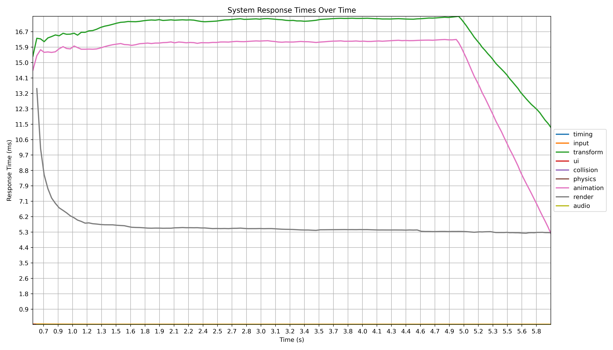
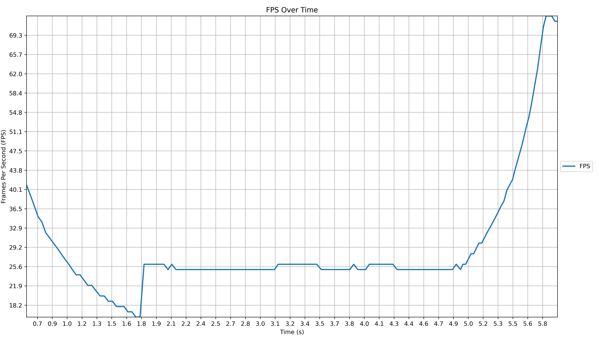

# Animation Benchmark Report

This benchmark ran for 5.90 seconds and captured 146 data points.

### Benchmark Information

- Number of Instances: 5000

### Average System Response Times

Average FPS: 30.12

- timing: 0.01 ms
- input: 0.02 ms
- transform: 16.60 ms
- ui: 0.00 ms
- collision: 0.00 ms
- physics: 0.01 ms
- animation: 14.79 ms
- render: 5.62 ms
- audio: 0.00 ms

### System Specifications

- Platform: Windows-11-10.0.26200-SP0
- Processor: Intel64 Family 6 Model 170 Stepping 4, GenuineIntel
- GPU: Intel(R) Arc(TM) Graphics
- RAM: 15.46 GB

### Charts

