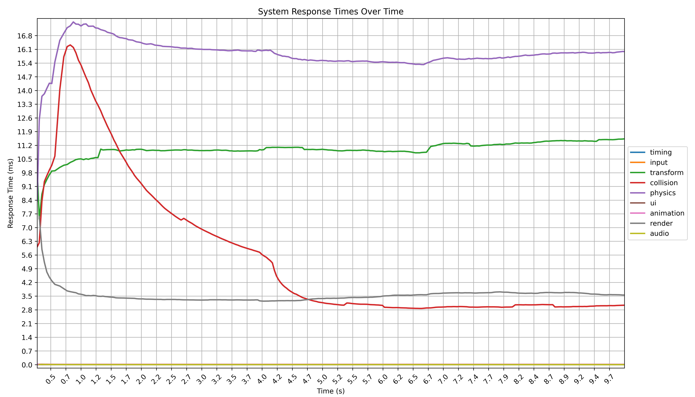
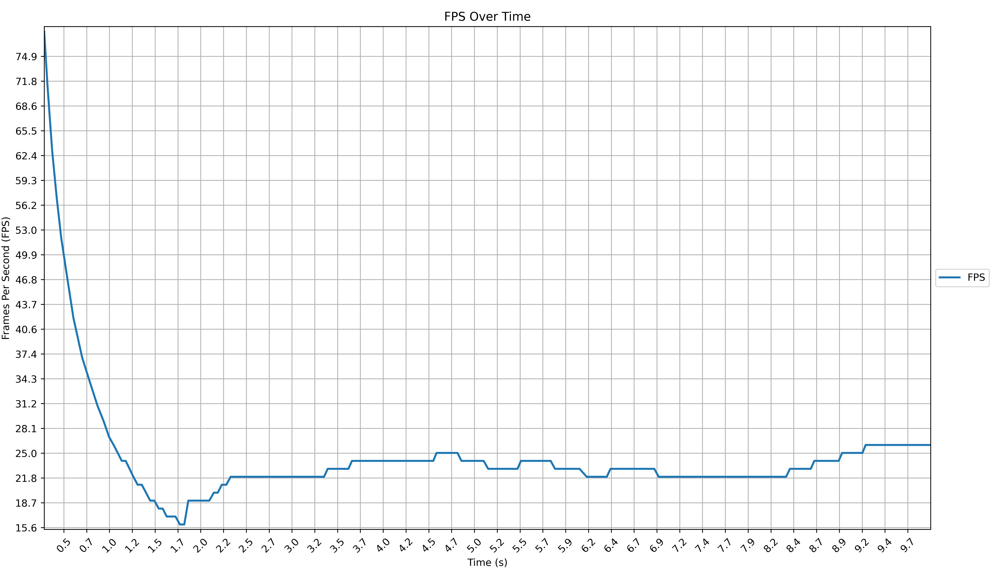

# Physics Benchmark Report

This benchmark ran for 9.83 seconds and captured 269 data points.

### Benchmark Information

- Number of Instances: 1000

### Average System Response Times

Average FPS: 29.07

- timing: 0.01 ms
- input: 0.03 ms
- transform: 7.31 ms
- ui: 0.01 ms
- collision: 15.87 ms
- physics: 10.44 ms
- animation: 0.02 ms
- render: 2.55 ms
- audio: 0.01 ms

### System Specifications

- Platform: Windows-11-10.0.26200-SP0
- Processor: Intel64 Family 6 Model 170 Stepping 4, GenuineIntel
- GPU: Intel(R) Arc(TM) Graphics
- RAM: 15.46 GB

### Charts

