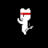

# Examples

### Physics and Collisions

[View Code](./physics_and_collisions.py)

### Button with Sound

[View Code](./button_and_sound/)

[▶ Watch Demo](../media/button_and_sound.mp4)

### Animated Sprite

[View Code](./animated_sprite/)

### Sin Wave

[View Code](./sin.py)

### Tween

[View Code](./tween.py)

### Text Input

[View Code](./input.py)

### Camera Movement using Input Actions

[View Code](./camera_with_actions.py)
